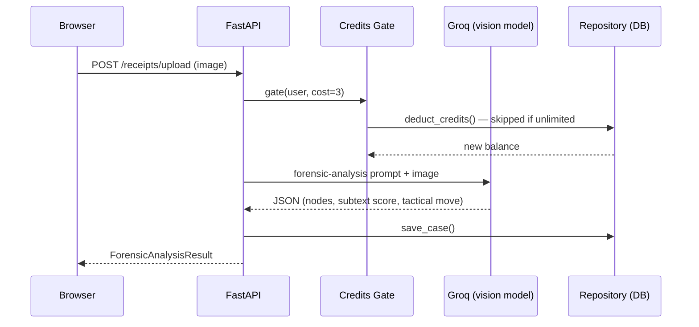

Debate & Win 🎯
Basic Details

Team Name: Mohammed Aakhil

Team Members
Team Lead: Aakhil - Cochin University Of Science and Technology
Project Description

Debate & Win is an AI-powered conversation co-pilot that analyzes screenshots of conversations and tells users what just happened, what it means, and what to do next.

📸 Screenshot → 🧠 Understand → 🎯 Next Move → 💬 Reply → 📸 New Screenshot → Repeat

Product Link:
https://debate-and-win.onrender.com/fumble

The Problem (that doesn't exist)

You sent a message.

They replied:

"K."

Now you're staring at the screen for 17 minutes wondering:

"Am I cooked?" 💀

People overthink conversations, misread messages, send terrible replies, and realize they fumbled only after pressing send.

The Solution (that nobody asked for)

Upload the receipts. 🧾

Debate & Win uses AI to reconstruct the conversation, understand the context, identify what's happening, and tell you what your next move should be.

It can:

🧠 Explain what just happened
🎯 Recommend your next move
💬 Generate possible replies
🚫 Tell you what NOT to send
🌳 Show possible conversation branches
🔥 Detect when you fumbled
🧾 Point to the actual messages behind its reasoning
🔄 Maintain conversation context as new screenshots are uploaded

Basically:

Your smartest terminally-online friend sitting beside you while you're texting.

Technical Details
Technologies/Components Used
For Software

Languages:

Python
TypeScript / JavaScript
HTML / CSS

Frameworks:

React 19
FastAPI
Vite
Tailwind CSS v4

Libraries / Tools:

Groq API
openai/gpt-oss-120b — text analysis
qwen/qwen3.8-27b — vision analysis
JWT Authentication
PostgreSQL
Supabase
Docker
Uvicorn
For Hardware

No dedicated hardware required.

The project runs through a web browser and cloud-based AI infrastructure.

Implementation
For Software
Installation
git clone <this-repo>
cd debate-win-backend

python -m venv venv
source venv/bin/activate

Install dependencies:

pip install -r requirements.txt

Configure environment variables:

cp .env.example .env

Add:

GROQ_API_KEY=your_key
SECRET_KEY=your_secret
SUPABASE_URL=your_url
SUPABASE_SERVICE_KEY=your_key
Run
uvicorn app.main:app --reload --port 8000

Or using Docker:

docker-compose up --build
Project Documentation
Screenshots
1. Debate & Win Dashboard

Caption: Main interface where users can start analyzing their conversation and access the different AI-powered tools.

2. Conversation Analysis

Caption: AI-powered analysis of the conversation, helping the user understand the situation and determine the next move.

3. Fumble Analysis

Caption: Fumble analysis that identifies potential mistakes in the user's conversation and explains what went wrong.

Diagrams
Workflow

Caption: Debate & Win continuously analyzes the conversation and provides context-aware recommendations as the conversation evolves.

Project Demo
Video

Demo:
https://youtu.be/sdlcAjVBTWU

The video demonstrates the Debate & Win interface, screenshot-based conversation analysis, AI reasoning, and recommendations for the user's next move.


Images:


## How It Works


**One concrete request — scanning a screenshot:**



Same shape for every other feature — a credit gate, one Groq call, one
persistence call — which is what makes the AI provider and the database
both swappable behind `app/services/ai.py` and `app/db/repo()` without
touching route logic.

## Endpoints

```
POST   /auth/register
POST   /auth/login
GET    /auth/me

GET    /credits/balance
POST   /credits/add
GET    /credits/costs

POST   /receipts/upload         (multipart image, costs 3 credits)
POST   /receipts/analyze        (text paste, costs 3 credits)
GET    /receipts/               (list past cases)
GET    /receipts/{id}           (get single case)

POST   /fumble/analyze          (costs 1 credit)

POST   /sparring/start
POST   /sparring/{id}/message   (costs 1 credit/turn)
GET    /sparring/{id}
POST   /sparring/{id}/verdict

GET    /war-room/stats
GET    /war-room/active-case
```

Full interactive docs at `http://localhost:8000/docs`

Live Demo

Product:
https://debate-and-win.onrender.com/fumble

Team Contributions

Mohammed Aakhil E- Everything

Made with ❤️ at TinkerHub Useless Projects

Drop the screenshot. We'll handle the next move. 💀


