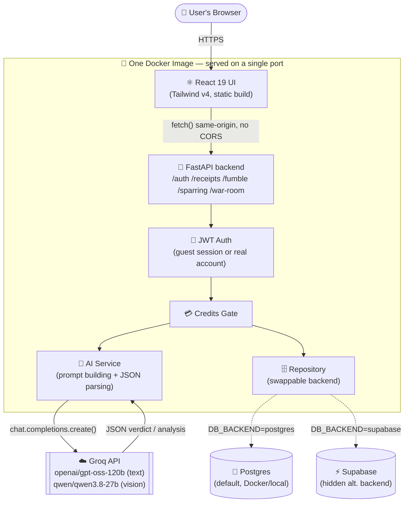
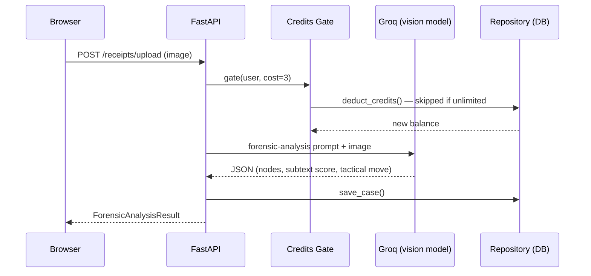

Debate and Win

Produt Link:
https://debate-and-win.onrender.com/fumble

What is it?

Debate & Win is an AI conversation co-pilot that analyzes screenshots of conversations and tells users what just happened, what it means, and what to do next.

Core loop:

📸 Screenshot → 🧠 Understand → 🎯 Next Move → 💬 Reply → 📸 New Screenshot → Repeat

Who is it for?

Primarily for young, online users (Gen Z) who want help navigating confusing, awkward, playful, or argumentative conversations—especially conversations with women.

What does it do?

Users upload a screenshot of their conversation. The AI:

Reconstructs the conversation and understands the context.
Explains what is happening right now.
Identifies shifts in tone, tension, topic, and conversational dynamics.
Tells the user what their next move should be.
Generates possible replies in different styles.
Warns them about replies they should NOT send.
Shows possible branches depending on how the other person responds.
Keeps the conversation state so users can return with another screenshot and continue from where they left off.


# Debate & Win — Backend API

FastAPI backend for the **Debate & Win** (Receipts AI Text Strategist) app.
Frontend and backend ship as **one Docker image** — FastAPI serves the React
build directly, so there's no separate frontend service and no CORS to
configure in production.

## Stack

| Layer | Tech |
|---|---|
| UI | React 19 + Tailwind v4 (built by Vite, served as static files by FastAPI) |
| API | FastAPI + Uvicorn |
| Auth | JWT (guest sessions auto-created, no login screen needed) |
| DB | **Postgres** (default — Docker locally) or **Supabase** (hidden, opt-in via `DB_BACKEND`) |
| Storage | Local disk (Postgres backend) or Supabase Storage (Supabase backend) |
| AI | Groq — `openai/gpt-oss-120b` (text) + `qwen/qwen3.8-27b` (vision) |
| Rate Limiting | In-process sliding window (swap Redis/slowapi for prod) |

## How It Works



**One concrete request — scanning a screenshot:**



Same shape for every other feature — a credit gate, one Groq call, one
persistence call — which is what makes the AI provider and the database
both swappable behind `app/services/ai.py` and `app/db/repo()` without
touching route logic.

## Endpoints

```
POST   /auth/register
POST   /auth/login
GET    /auth/me

GET    /credits/balance
POST   /credits/add
GET    /credits/costs

POST   /receipts/upload         (multipart image, costs 3 credits)
POST   /receipts/analyze        (text paste, costs 3 credits)
GET    /receipts/               (list past cases)
GET    /receipts/{id}           (get single case)

POST   /fumble/analyze          (costs 1 credit)

POST   /sparring/start
POST   /sparring/{id}/message   (costs 1 credit/turn)
GET    /sparring/{id}
POST   /sparring/{id}/verdict

GET    /war-room/stats
GET    /war-room/active-case
```

Full interactive docs at `http://localhost:8000/docs`

Video :
https://youtu.be/sdlcAjVBTWU

## Local Setup

### 1. Prerequisites

- Python 3.12+
- A [Supabase](https://supabase.com) project (free tier works)
- A [Groq](https://console.groq.com) API key

### 2. Clone & install

```bash
git clone <this-repo>
cd debate-win-backend
python -m venv venv
source venv/bin/activate       # Windows: venv\Scripts\activate
pip install -r requirements.txt
```

### 3. Configure environment

```bash
cp .env.example .env
# Edit .env — fill in SUPABASE_URL, SUPABASE_SERVICE_KEY, GROQ_API_KEY, SECRET_KEY
```

Generate a SECRET_KEY:
```bash
python -c "import secrets; print(secrets.token_hex(32))"
```

### 4. Set up Supabase

1. Go to your Supabase project → **SQL Editor**
2. Run the migration:

```bash
cat supabase/migrations/001_init.sql
# Paste and run in the SQL editor
```

3. Create a Storage bucket named `receipts` (private):
   - **Storage** → **New bucket** → name: `receipts`, uncheck Public

4. Copy your keys from **Settings → API**:
   - `SUPABASE_URL` = Project URL
   - `SUPABASE_SERVICE_KEY` = `service_role` key (secret!)
   - `SUPABASE_ANON_KEY` = `anon` key

### 5. Run

```bash
uvicorn app.main:app --reload --port 8000
```

Or with Docker:
```bash
docker-compose up --build
```

### 6. Test

```bash
# Register
curl -X POST http://localhost:8000/auth/register \
  -H "Content-Type: application/json" \
  -d '{"email":"you@test.com","password":"testpass123","handle":"overthinker"}'

# Use the returned token for all other calls:
# -H "Authorization: Bearer <token>"
```

## Credits System

| Operation | Cost |
|---|---|
| Forensic receipt analysis | 3 credits |
| Fumble radar analysis | 1 credit |
| Sparring turn (per message) | 1 credit |
| New user bonus | 20 free credits |

Returns HTTP `402` with `{"error": "insufficient_credits"}` when balance is zero.

## Zero Log Retention

Set `ZERO_LOG_RETENTION=true` (default) to never persist raw message content.
Only metadata (scores, lengths, timestamps) is stored.

## Production Checklist

- [ ] Set `ENV=production`
- [ ] Rotate `SECRET_KEY`
- [ ] Set your real frontend URL in `CORS_ORIGINS`
- [ ] Replace in-process rate limiter with Redis + `slowapi`
- [ ] Add Stripe webhook at `POST /credits/stripe-webhook`
- [ ] Deploy to Railway / Render / Fly.io (single Dockerfile)

Images:


